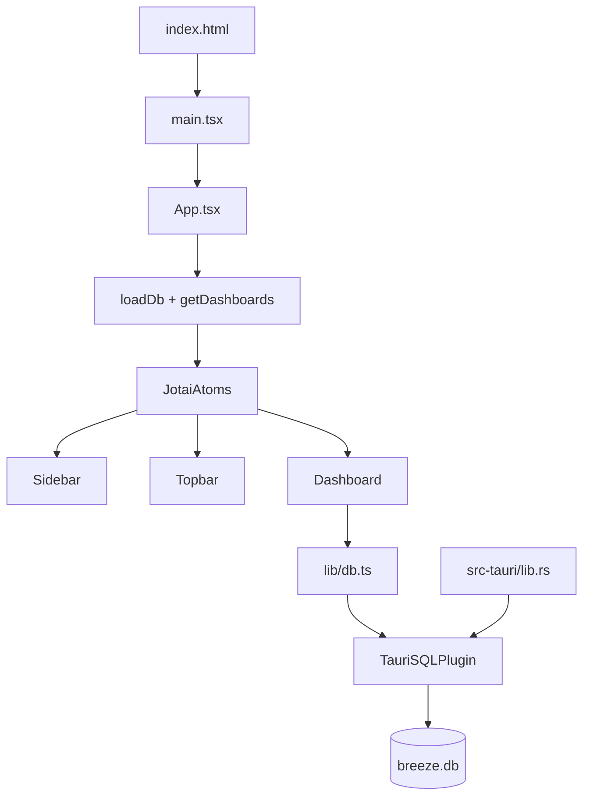

# Breeze Project Architecture for Coding Agents

## Purpose

Breeze is a Tauri desktop app for managing customizable dashboard views with draggable widgets.

Stack:
- Tauri 2 (Rust host) + SQLite plugin
- React 19 + TypeScript + Vite
- Jotai for client state
- Tailwind CSS 4 + daisyUI 5 for styling
- `react-grid-layout` for dashboard layout

## Quick Start (How the app runs)

- Install deps: `bun install`
- Run desktop app in dev: `bun tauri dev`
- Build frontend bundle: `bun run build`
- Preview frontend bundle: `bun run preview`

Core runtime chain:

## Project Layout (What is where)

### Root

- `package.json`: scripts + JS/TS dependencies
- `bun.lock`: Bun lockfile
- `vite.config.ts`: Vite config, path alias, Tauri dev server behavior
- `tsconfig.json`: strict TS settings + `@/*` alias to `src/*`
- `README.md`: user-facing project intro
- `index.html`: frontend HTML entry

### Frontend (`src/`)

- `src/main.tsx`
  - Frontend entry point.
  - Mounts `App` and imports grid CSS.

- `src/app/`
  - `App.tsx`: root composition + app boot/init behavior.
  - `App.css`: Tailwind + daisyUI setup and theme tokens.

- `src/features/`
  - Feature-level components and behavior:
    - `Sidebar.tsx`: dashboard list, reorder, create dashboard.
    - `Topbar.tsx`: rename dashboard, toggle edit mode, add widgets.
    - `Dashboard.tsx`: grid rendering, resize/drag persistence, widget removal.

- `src/components/`
  - Reusable UI components used by features.
  - `Widget/` contains widget shell and concrete widget renderers (`LinkWidget`, `NotesWidget`).
  - `AddWidgetsModal.tsx`, `Toast.tsx`, `BreezeLogo.tsx`.

- `src/atoms/`
  - Jotai atoms and shared app state contracts.
  - Includes dashboard state, layout state, edit mode, toast, and widget metadata maps.

- `src/lib/`
  - Non-UI domain logic and utility modules:
    - `db.ts`: SQLite access wrappers used by frontend.
    - `gridConfig.ts`: grid constants.
    - `findWidgetSlot.ts`: slot-finding logic for new widgets.
    - `widgetTypes.ts`: widget registry/default metadata.

- `src/assets/`
  - Frontend static assets.

### Tauri/Rust (`src-tauri/`)

- `src-tauri/src/main.rs`
  - Rust binary entry point.

- `src-tauri/src/lib.rs`
  - Tauri builder setup.
  - Registers plugins and SQL migrations.

- `src-tauri/migrations/`
  - SQL schema migrations (`001_initial.sql`, `1_1_add_widget_metadata.sql`).

- `src-tauri/tauri.conf.json`
  - Tauri app/window/build config.

- `src-tauri/Cargo.toml`
  - Rust crate dependencies and build metadata.

## Ownership Rules (What logic belongs where)

Use these rules when deciding where to place new files/functions.

- `src/features/*`
  - Place feature orchestration and view-specific event handlers here.
  - Good: wire atoms, call `lib` functions, coordinate component composition.
  - Avoid: generic reusable primitives that are not feature-specific.

- `src/components/*`
  - Place shared presentational and reusable interactive UI components.
  - Good: widget card shell, modal, toast, logos/icons.
  - Avoid: cross-feature business orchestration or DB access.

- `src/atoms/*`
  - Place shared state primitives and derived state.
  - Good: source-of-truth client state, selectors/derived atoms.
  - Avoid: async side effects that belong in feature flows or `lib`.

- `src/lib/*`
  - Place domain logic, persistence wrappers, and pure utilities.
  - Good: DB methods, layout algorithms, type registries/defaults.
  - Avoid: React component rendering and UI concerns.

- `src-tauri/src/*`
  - Place host-level runtime behavior and plugin setup.
  - Good: plugin registration, migration registration, native command wiring.
  - Avoid: frontend UI logic.

- `src-tauri/migrations/*`
  - Place schema migrations only.
  - Every schema change should be additive via a new migration version.

## Agent Navigation Guide (If you need X, start here)

- App startup / root composition:
  - `src/main.tsx`
  - `src/app/App.tsx`

- Global state / current dashboard / edit mode:
  - `src/atoms/index.ts`

- DB reads/writes for dashboards/widgets:
  - `src/lib/db.ts`
  - `src-tauri/migrations/*.sql`
  - `src-tauri/src/lib.rs`

- Dashboard rendering and grid behavior:
  - `src/features/Dashboard.tsx`
  - `src/lib/gridConfig.ts`
  - `src/lib/findWidgetSlot.ts`

- Dashboard list/order/add behavior:
  - `src/features/Sidebar.tsx`

- Topbar actions (rename, edit mode, add widget modal):
  - `src/features/Topbar.tsx`
  - `src/components/AddWidgetsModal.tsx`

- Widget implementations and widget registry:
  - `src/components/Widget/*`
  - `src/lib/widgetTypes.ts`

- Styling/theme behavior:
  - `src/app/App.css`
  - UI classes in `src/features/*` and `src/components/*`

## Where to Create New Code

### Add a new widget type

1. Add widget type and defaults in `src/lib/widgetTypes.ts`.
2. Extend widget metadata/type contracts in `src/atoms/index.ts` if needed.
3. Create component in `src/components/Widget/` (for example `ClockWidget.tsx`).
4. Update widget renderer in `src/components/Widget/index.tsx`.
5. Add picker option/icon in `src/components/AddWidgetsModal.tsx`.
6. If persisted metadata changes are needed, add a new migration in `src-tauri/migrations/` and register it in `src-tauri/src/lib.rs`.

### Add a new feature-level interaction

1. Start in the owning feature file under `src/features/`.
2. Reuse or add shared UI in `src/components/` only if broadly reusable.
3. Move reusable non-UI logic to `src/lib/`.
4. Add/adjust atoms in `src/atoms/` only for shared state.

### Add a DB field or change persistence behavior

1. Add a new migration file under `src-tauri/migrations/`.
2. Register migration in `src-tauri/src/lib.rs` with next version number.
3. Update `src/lib/db.ts` read/write logic and return types.
4. Update callers in `src/features/*` and/or `src/atoms/*`.
5. Ensure backward-compatible handling for existing rows.

## Data and Persistence Notes

- Current schema has:
  - `dashboards` table (`id`, `name`, `sort_order`, timestamps).
  - `widgets` table for layout coordinates and ownership.
- There is a migration adding `widgets.type`, `widgets.title`, and `widgets.data`.
- Current `src/lib/db.ts` layout methods (`getWidgets`, `upsertWidgets`) persist position/size, but do not yet persist full widget metadata fields.
- Widget metadata is currently managed in client state (`widgetMetadataAtom`) at runtime.

When extending metadata persistence, keep `db.ts`, migrations, and widget components aligned.

## Conventions and Constraints

- Use existing path alias `@/*` for frontend imports.
- Keep TypeScript strictness intact; avoid adding loose `any` types.
- Prefer daisyUI + Tailwind utility classes over custom CSS.
- Keep feature orchestration out of low-level reusable components.
- Do not edit existing migrations; add new migration files instead.

## Practical Checklists for Agents

Before coding:
- Identify owning layer (`features`, `components`, `atoms`, `lib`, `src-tauri`).
- Check whether change affects schema, state shape, and UI together.
- Confirm if behavior should be dashboard-specific or global.

After coding:
- Ensure state, DB wrappers, and UI are consistent.
- Verify imports and alias usage (`@/...`).
- Verify no cross-layer leakage (for example DB calls inside presentational components).

